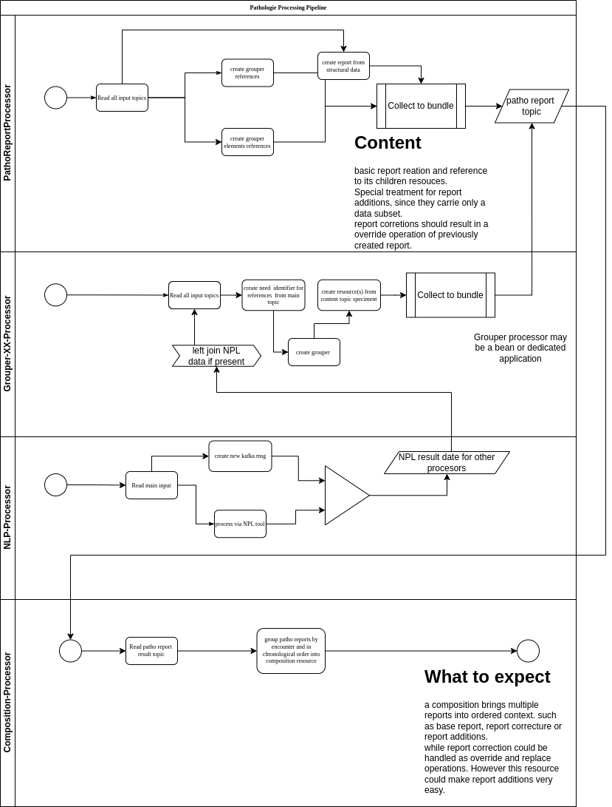

# Nexus-Patho-to-Fhir
Kafka processor transforms Nexus pathology report data to FHIR resources meeting MII pathology profiling

Details about applied MII FHIR profiles can be reviewed [Medizininformatik Initiative - Modul Pathologie](https://simplifier.net/MedizininformatikInitiative-ModulPathologie/~introduction)

## Workflow (TODO)

* explain expected input
* explain created topics and their purpose

### processor overview (wip)
This is how components will be organized: 

# Requirements
* Kafka 3.0+

# Deployment (TODO)
* Kafka connect
* sample environment variable file
* expected topic configuration

# Build
You may build a docker image `nexus-patho-to-fhir:latest' via
```
./gradlew bootBuildImage
```

# Development (TODO)
* explain environment variables

